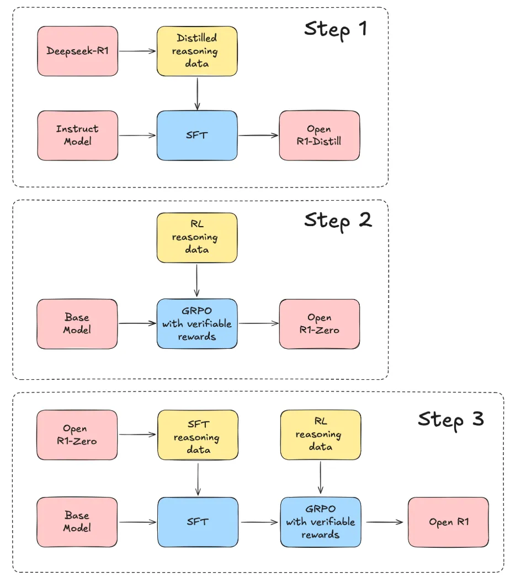

## Inference Preference Optimization (IPO): Augmenting GRPO with Memory
***

### Overview
Inference Preference Optimization (IPO) enhances reasoning in LLMs by integrating memory retrieval into Group Relative Policy Optimization (GRPO). In doing this, we can measure how models adapt responses based on user-specific context, preference, and learning trajectory across interactions.

The goal of this repository is to first evaluate memory-conditioned Chain-of-Thought (mCoT) reasoning in LLMs on the GSM8K dataset. To validate this approach, we retrieve sample user profiles with FAISS. Once validated, we condition GRPO with user memory, extending preference optimization to user-specific reasoning trajectories. 

### Key Features
- FAISS-based retrieval to match questions with relevant student profiles
- Memory-conditioned CoT (mCoT) for dynamically refined responses, validating memory retrieval effectiveness
- Inference Preference Optimization (IPO): GRPO conditioned with user memory to personalize reasoning sequences




## Installation & Setup

### 1. Install Dependencies
```bash
pip install -r requirements.txt
```
Or manually install:
```bash
pip install torch==2.1.0+cu118 -f https://download.pytorch.org/whl/torch_stable.html transformers datasets faiss-cpu sentence-transformers matplotlib seaborn pandas spacy einops transformers_stream_generator trl tiktoken tf-keras numpy==1.24.4 flash-attn
```

### 2. Clone Repository
```bash
git clone https://github.com/dr2633/mCoT-GRPO-IPO.git
cd mCoT-GRPO-IPO
```

### 3. Connecting to a Lambda Instance

#### **1. Set Up SSH Access**
Generate an SSH key pair if you do not have one:
```bash
ssh-keygen -t ed25519 -f ~/.ssh/lambda_key -C "your-email@example.com"
```
Ensure the key has the correct permissions:
```bash
chmod 600 ~/.ssh/lambda_key
```

#### **2. Add Your Public Key to Lambda Cloud**
1. Log in to [Lambda Cloud](https://lambdalabs.com/cloud).
2. Go to **SSH Keys** under **Settings**.
3. Click **Add SSH Key**.
4. Copy the public key:
   ```bash
   cat ~/.ssh/lambda_key.pub
   ```

#### **3. Connect to Your Instance**
```bash
ssh -i ~/.ssh/lambda_key ubuntu@<your-instance-ip>
```

Verify that the GPU is detected:
```bash
nvidia-smi
```

## Usage

### Run Memory-Conditioned CoT Evaluation
```bash
cd cot 
python verify-model.py --model_name Qwen/Qwen-7B --subset_size 50 --max_new_tokens 256 --device cuda

python run_baseline_cot_1.py --model_name Qwen/Qwen-7B --subset_size 50 --max_new_tokens 256 --device cuda
```

This script runs Chain-of-Thought (CoT) reasoning on a subset of GSM8K. You can swap models as needed.


To validate FAISS-based memory retrieval, use the following script:

```bash
python run_baseline_faiss.py --model_name Qwen/Qwen-7B --subset_size 50 --max_new_tokens 256 --device cuda
```

This script:
- Retrieves the most relevant student profile using FAISS
- Generates explanations based on the retrieved profile
- Evaluates results across different temperatures

Example result format:
```json
{
  "index": 5,
  "temperature": 0.6,
  "question": "If a train travels 60 mph for 3 hours, how far does it go?",
  "gold_solution": "180 miles.",
  "retrieved_profile": "5th grade",
  "generated_text": "The train goes 180 miles because distance = speed × time.",
  "output_tokens": 42,
  "perplexity": 12.3,
  "semantic_similarity": 0.85
}
```


### Validate Outputs
Results are stored in:
```
data/qwen/results_temp_<temperature>_<timestamp>.json
```
To inspect:
```bash
cat data/qwen/results_temp_0.6_<timestamp>.json | jq .
```

## Reinforcement Learning with GRPO

### Train GRPO with Memory-Augmented Reasoning
Train a model using GRPO to optimize reasoning paths based on memory retrieval.
```bash
python rl/train_rl_memory.py
```


### Evaluate GRPO-Trained Model
To compare pre-trained vs. GRPO-optimized reasoning. This measures accuracy, token efficiency, and personalization fidelity.

```python
python evaluate_rl.py
```

---

### Run Detailed Comparison Baseline CoT vs mCoT
To compare baseline CoT vs. memory-augmented CoT (mCoT). This logs results and highlights improvements from memory-guided reasoning trajectories.

```python
python evaluate_cot_vs_mcot.py
  ```

---

## Running Unit Tests
Before deploying, ensure all tests pass. This runs unit and integration tests for FAISS retrieval, mCoT, and GRPO conditioned with memory (IPO)

```python
pytest tests/
  ```

